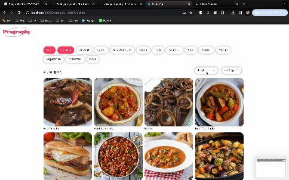

# prography-9th-frontend

## 📌 프로젝트 실행 방법

```shell
cd project
npm i
npm start
```

- http://localhost:3000 접속 ▶️ 이미 3000 포트가 사용중일 경우 콘솔 안내 메세지에 따라서 접속

## 🛠️ 사용 기술


## 🔍 구현 화면 미리 보기

- 카테고리 조회 및 무한 스크롤
  

- 데이터 정렬 및 뷰 선택
  

## 📁 폴더 구조

```
src
├── App.css
├── App.tsx
├── assets
│   └── logo.png
├── components
│   ├── Category.tsx
│   ├── DataControl.tsx
│   ├── ItemCard.tsx
│   ├── Results.tsx
│   └── Skeleton.tsx
├── index.css
├── index.tsx
├── react-app-env.d.ts
├── reportWebVitals.ts
├── setupTests.ts
├── store
│   └── store.ts
└── types
    ├── apiResponse.ts
    └── option.ts
```

### ✅ 커밋 컨벤션

| 커밋 유형 | 설명                        |
| --------- | --------------------------- |
| feat      | 새로운 기능 구현, 특징 추가 |
| style     | UI/스타일 수정              |
| type      | 타입 관련 작업              |
| refactor  | 리팩토링                    |
| fix       | 버그해결, 수정              |
| rename    | 파일명, 디렉토리명 변경     |
| docs      | 문서 관련 작업              |
| chore     | 자잘한 수정에 대한 커밋     |
